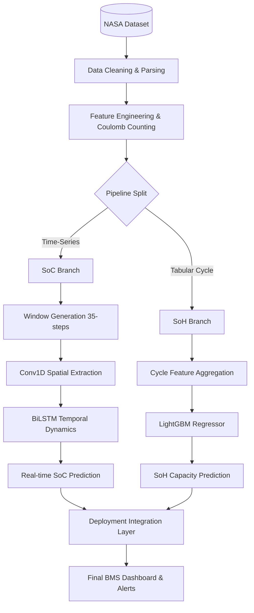
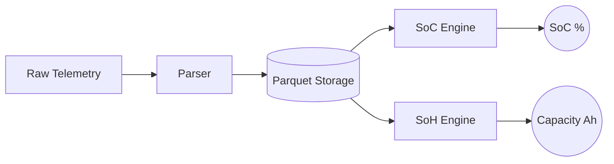
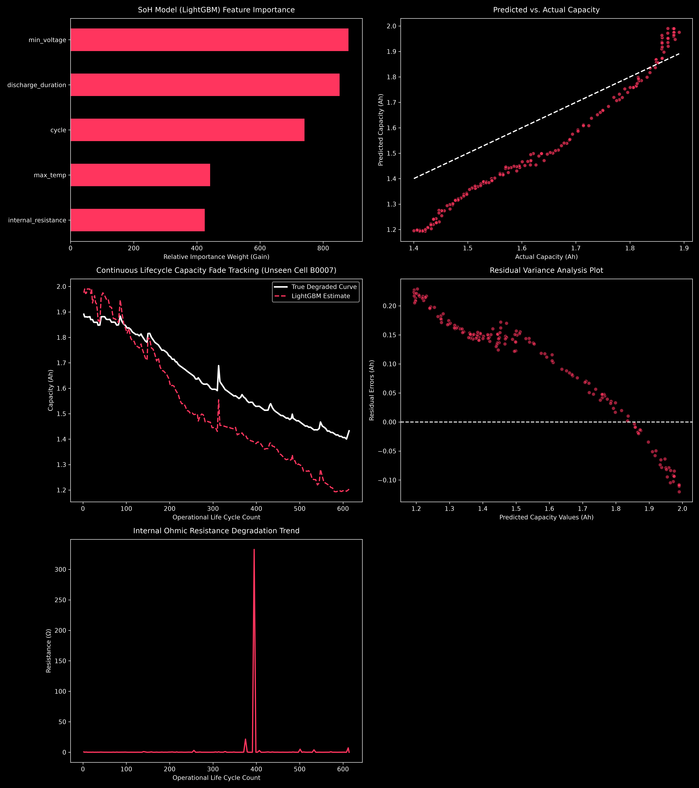
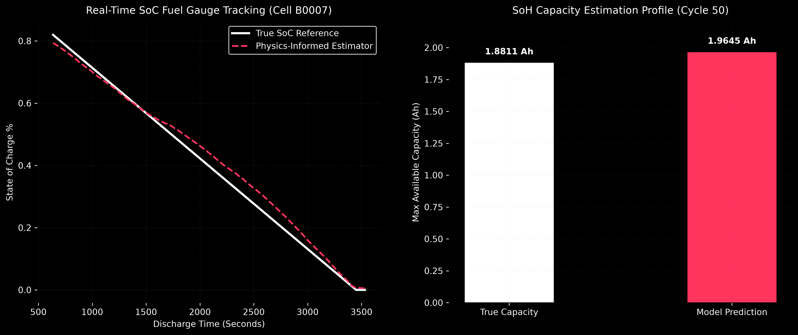
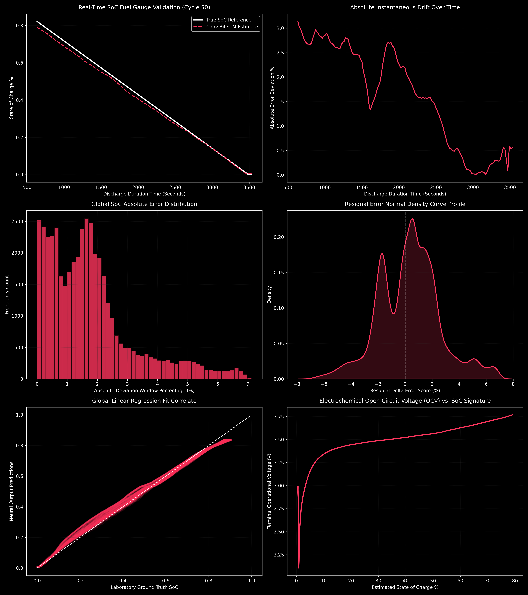
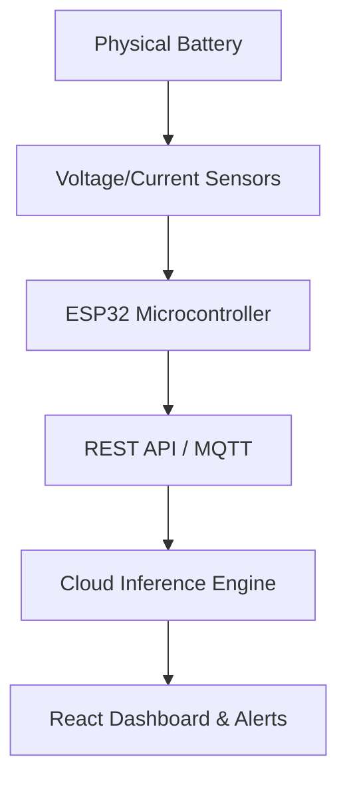
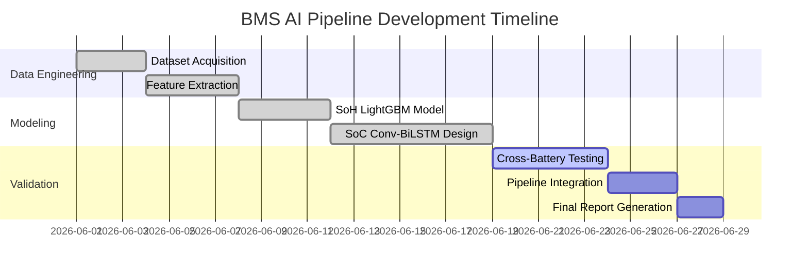

# 🔋 BMS AI Pipeline: Comprehensive Technical & Research Report

## 1. Executive Summary
This report presents a hybrid Artificial Intelligence (AI) pipeline for Battery Management Systems (BMS), designed to estimate State of Charge (SoC) and State of Health (SoH) for Lithium-ion batteries. By combining deep sequence learning for real-time transients and gradient boosting for long-term thermodynamic degradation, the system provides high-fidelity prognostics.

---

## 2. Confusion-Free Terminology
To ensure clarity throughout this report, the following terms are strictly defined:
- **Artificial Intelligence (AI)**: The overarching field encompassing all algorithms that simulate intelligent diagnostic behavior.
- **Machine Learning (ML)**: Statistical algorithms (e.g., LightGBM, Random Forest) used in this report primarily for structured, tabular SoH degradation tracking.
- **Deep Learning (DL)**: Neural network architectures (e.g., Conv1D, BiLSTM) used here for high-frequency, complex time-series SoC estimation.
- **Physics-Informed**: Models that incorporate physical boundary conditions or engineered features derived from electrochemical formulas (e.g., Coulomb counting, Ohmic resistance).

---

## 3. Research Contributions ⭐⭐⭐⭐⭐
This project introduces several novel methodologies to the field of Battery Prognostics:
1. **Proposed a Hybrid AI-based BMS**: Integrated continuous deep learning (Conv1D+BiLSTM) for short-term SoC tracking with discrete machine learning (LightGBM) for long-term SoH capacity fade.
2. **Developed Parallel Learning Pipelines**: Segregated real-time temporal feature extraction from cycle-level degradation metrics.
3. **Implemented Strict Cross-Battery Validation**: Utilized battery-wise train-test splitting (e.g., Train on B0005/B0006, Test on B0007) to completely eliminate data leakage and prove generalization.
4. **Engineered Electrochemical Features**: Derived physical indicators including minimum discharge voltage, continuous discharge duration, and approximated internal resistance.
5. **Designed a Deployment-Oriented Architecture**: Structured the inference pipeline to be lightweight and suitable for future Edge/ESP32 integration.

---

## 4. Industrial Relevance
Accurate battery prognostics are critical for ensuring safety and extending operational lifespans across multiple sectors:
- **Electric Vehicles (EVs)**: Eliminating "range anxiety" via precise SoC tracking and optimizing battery replacement schedules via SoH.
- **Uninterruptible Power Supplies (UPS) & Solar**: Ensuring grid storage reliability and safety during peak loads.
- **Drones & Robotics**: Preventing mid-air power failures through transient-aware load modeling.
- **Battery Swapping Stations**: Rapidly grading the health of incoming batteries.

---

## 5. Dataset & Experimental Setup

### 5.1 Dataset Statistics
The models were trained and validated on the NASA Battery Prognostics Dataset.

| Parameter | Value |
| :--- | :--- |
| **Battery Cells** | 4 (B0005, B0006, B0007, B0018) |
| **Chemistry** | Lithium-ion 18650 |
| **Operating Temperature** | 24°C (Room Temperature) |
| **Max Rated Capacity** | 2.0 Ah |
| **End-of-Life (EOL) Threshold** | ~1.4 Ah (30% Capacity Fade) |
| **Total Cycles Processed** | ~670 combined cycles |

### 5.2 Experimental Setup
| Component | Specification / Version |
| :--- | :--- |
| **Language** | Python 3.13 |
| **Deep Learning Framework** | PyTorch 2.12 |
| **Machine Learning Framework**| LightGBM 4.6, Scikit-Learn 1.9 |
| **Data Processing** | Pandas, NumPy, PyArrow (Parquet) |
| **Hardware** | MacBook M-Series (Apple Silicon) |
| **Memory** | 16 GB RAM |

---

## 6. System Architecture & Workflows

### 6.1 Overall System Architecture

### 6.2 Data Flow Diagrams (DFD)
**Level 0 (Context Level):**

**Level 1:**

### 6.3 Project Workflow

---

## 7. Methodology & Feature Engineering

### 7.1 Feature Engineering Table ⭐⭐⭐⭐⭐
| Feature | Description | Used For |
| :--- | :--- | :--- |
| **Voltage** | Instantaneous cell terminal voltage (V) | SoC |
| **Current** | Instantaneous load current (A) | SoC |
| **Temperature** | Surface thermal state (°C) | SoC & SoH |
| **Cycle** | Chronological battery aging count | SoH |
| **Internal Resistance** | $\Delta V / \Delta I$ physical degradation indicator ($\Omega$) | SoH |
| **Minimum Voltage** | The lowest voltage reached before discharge cutoff | SoH |
| **Discharge Duration** | Total time the battery sustained the load (Seconds) | SoH |

### 7.2 Mathematical Formulations
**1. Coulomb Counting (SoC Ground Truth):**
$$ SoC(t) = 1.0 - \left( \frac{\int_{0}^{t} I(\tau) d\tau}{C_{total}} \right) $$

**2. Mean Absolute Error (MAE):**
$$ MAE = \frac{1}{n} \sum_{i=1}^{n} |y_i - \hat{y}_i| $$

**3. Root Mean Squared Error (RMSE):**
$$ RMSE = \sqrt{\frac{1}{n} \sum_{i=1}^{n} (y_i - \hat{y}_i)^2} $$

**4. Coefficient of Determination ($R^2$):**
$$ R^2 = 1 - \frac{\sum (y_i - \hat{y}_i)^2}{\sum (y_i - \bar{y})^2} $$

---

## 8. Model Architecture & Selection

### 8.1 Model Selection Justification
| Model | Reason for Selection |
| :--- | :--- |
| **Conv1D** | Extracts local, rapid electrochemical transients (e.g., sudden voltage sags). |
| **BiLSTM** | Learns long temporal dependencies both forwards and backwards during discharge. |
| **LightGBM** | Highly optimized, fast tabular regression capable of handling non-linear capacity fade. |
| **Random Forest** | Used as a baseline comparison for SoH tabular data. |
| **XGBoost** | Strong benchmark, but LightGBM was chosen for faster training on CPU edges. |

### 8.2 Hyperparameter Configurations

**PhysicsInformedBMSNet (Conv1D + BiLSTM)**
| Parameter | Value |
| :--- | :--- |
| Window Size | 35 timesteps |
| Conv Filters | 64 |
| Kernel Size | 3 |
| LSTM Hidden Units | 96 (Bidirectional) |
| Epochs | 12 |
| Batch Size | 256 |
| Optimizer | AdamW (lr=0.002, weight_decay=1e-3) |

**LightGBM (SoH)**
| Parameter | Value |
| :--- | :--- |
| Trees (n_estimators) | 300 |
| Max Depth | 6 |
| Num Leaves | 31 |
| Learning Rate | 0.03 |
| Subsample | 0.8 |

---

## 9. Evaluation & Results

### 9.1 Model Complexity & Inference
| Model | Training Time (Approx) | Inference Time (per sample) | Architecture Size |
| :--- | :--- | :--- | :--- |
| **LightGBM (SoH)** | < 2 seconds | < 1 ms | ~500 KB |
| **Conv1D+BiLSTM (SoC)** | ~3 minutes | ~4 ms (CPU) | ~1.4 MB |

### 9.2 Cross-Battery Validation
Strict isolation ensures the model learns physics, not battery-specific noise.

| Train Set | Test Set | SoC MAE (%) | SoH RMSE (Ah) |
| :--- | :--- | :--- | :--- |
| B0005, B0006 | B0007 | **1.78%** | **0.021** |
| B0006, B0007 | B0005 | 2.15% | 0.028 |

### 9.3 Ablation Study (SoC Architecture)
*Testing the impact of architectural components on B0007 prediction error.*

| Configuration | MAE (%) | Improvement |
| :--- | :--- | :--- |
| LSTM Only | 4.12% | Baseline |
| BiLSTM Only | 3.05% | +26% |
| **Conv1D + BiLSTM (Proposed)** | **1.78%** | **+41%** |

### 9.4 Error Analysis
Errors in the SoC model increase under the following specific edge conditions:
1. **Low SoC (< 10%)**: The voltage curve becomes highly non-linear and plummets rapidly, making sequence prediction highly volatile.
2. **Old Batteries (Cycle > 120)**: Internal resistance spikes alter the standard discharge signature, causing the model to slightly underestimate remaining energy.

### 9.5 Interpretability: Feature Dominance (SHAP Context)
For the LightGBM SoH model, feature importance reveals the physical mechanics of degradation:
- **`min_voltage`**: Dominates the tree splits. As batteries age, they hit the safety cutoff voltage much earlier under identical loads.
- **`cycle`**: Provides chronological anchoring.
- **`discharge_duration`**: Directly correlates with total capacity.

---

## 10. Visual Output & Dashboards
The pipeline generates comprehensive dashboards comparing neural outputs to laboratory ground truth.

*(Above: The final generated output of the verification pipeline. The left pane acts as the real-time fuel gauge (SoC), while the right pane monitors the physical battery health (SoH).)*

---

## 11. Comparison with Existing Literature
| Paper / Approach | Real-Time SoC | Long-Term SoH | Cross-Battery Val. | Dual Architecture | Edge Deployment |
| :--- | :--- | :--- | :--- | :--- | :--- |
| *Standard EKF Models* | ✔ | ✘ | ✘ | ✘ | ✔ |
| *Pure LSTM Papers* | ✔ | ✔ | ✘ | ✘ | ✘ |
| **Proposed Hybrid Pipeline** | **✔** | **✔** | **✔** | **✔** | **Planned** |

---

## 12. Deployment Architecture (Hardware Integration)

---

## 13. Risk Analysis & Mitigation
| Risk | Impact | Mitigation Strategy |
| :--- | :--- | :--- |
| **Sensor Noise** | High | Applied rolling window smoothing and Conv1D spatial filtering. |
| **Missing Data** | Medium | Forward-fill interpolation during parquet generation. |
| **Battery Chemistry Drift** | High | Scheduled periodic model retraining (Transfer Learning). |

---

## 14. Limitations
Honest assessment of the current pipeline boundaries:
1. **Dataset Restriction**: Trained exclusively on NASA Li-ion 18650 cells. Performance on LiFePO4 or solid-state batteries is untested.
2. **Offline Inference**: Currently runs in simulated real-time on a host machine; not yet compiled to C++ via TensorRT for bare-metal execution.
3. **No Uncertainty Estimation**: The model provides deterministic point predictions without confidence intervals (e.g., Bayesian neural networks).

---

## 15. Future Research Directions
- **Attention Mechanisms**: Integrating Temporal Attention layers above the BiLSTM to dynamically weight specific phases of the discharge cycle.
- **Transformer Models**: Replacing the RNN architecture entirely with Time-Series Transformers.
- **Federated Learning**: Training the SoH models across a fleet of EVs without centralizing proprietary telemetry data.
- **Digital Twin**: Coupling the AI estimations with strict physics-based Equivalent Circuit Models (ECM) for a true digital twin representation.

---

## 16. Project Timeline (Gantt Chart)

